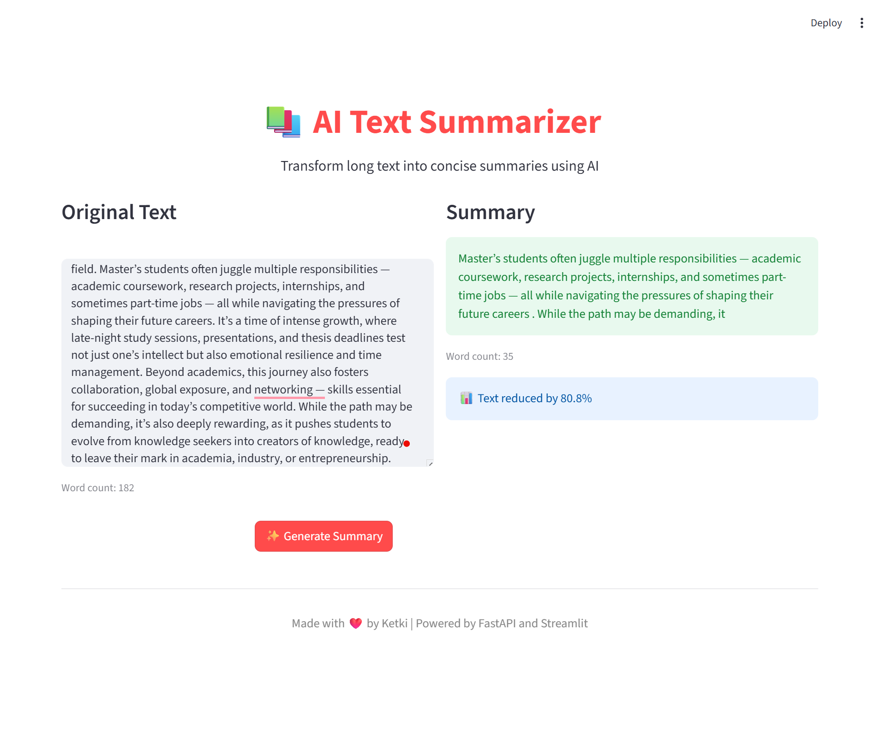

# 📚 AI Text Summarizer

A beautiful web application that uses AI to transform long text into concise summaries. Built with Streamlit for the frontend and FastAPI for the backend, powered by Hugging Face's transformers library.

## ✨ Features

- 🎨 Modern and intuitive user interface
- 📊 Real-time word count tracking
- 📉 Text reduction percentage calculation
- ⚡ Fast AI-powered summarization
- 🔄 Live updates with auto-reload
- 💡 Clean two-column layout

## 🚀 Demo

The application provides:
- Left panel: Input your long text
- Right panel: View the AI-generated summary
- Statistics: Word count and reduction percentage

## 🛠️ Technologies Used

- **Frontend**: Streamlit
- **Backend**: FastAPI
- **AI Model**: Hugging Face Transformers (DistilBART)
- **Deep Learning**: PyTorch

## 📋 Prerequisites

- Python 3.8 or higher
- pip (Python package installer)

## 🔧 Installation

1. Clone the repository:
```bash
git clone https://github.com/yourusername/text-summarizer-api.git
cd text-summarizer-api
```

2. Create a virtual environment:
```bash
python -m venv venv
```

3. Activate the virtual environment:
   - Windows:
     ```bash
     .\venv\Scripts\activate
     ```
   - macOS/Linux:
     ```bash
     source venv/bin/activate
     ```

4. Install required packages:
```bash
pip install -r requirements.txt
```

## 🎮 Usage

1. Start the FastAPI backend server:
```bash
python -m uvicorn main:app --reload
```
The backend will run on `http://127.0.0.1:8000`

2. In a new terminal, start the Streamlit frontend:
```bash
streamlit run app.py
```
The frontend will open automatically in your browser at `http://localhost:8501`

3. Use the application:
   - Paste or type your text in the left text area
   - Click the "✨ Generate Summary" button
   - View your AI-generated summary on the right side
   - See statistics like word count and reduction percentage

## 📁 Project Structure

```
text-summarizer-api/
│
├── app.py              # Streamlit frontend application
├── main.py             # FastAPI backend server
├── requirements.txt    # Python dependencies
├── README.md          # Project documentation
└── .gitignore         # Git ignore file
```

## 🔌 API Endpoints

### POST `/summarize`
Generates a summary of the provided text.

**Request Body:**
```json
{
  "text": "Your long text here..."
}
```

**Response:**
```json
{
  "summary": "Concise summary of the text..."
}
```

## ⚙️ Configuration

The summarization model can be customized in `main.py`:
- `max_length`: Maximum length of the summary (default: 50)
- `min_length`: Minimum length of the summary (default: 25)
- `do_sample`: Whether to use sampling (default: False)

## 🤝 Contributing

Contributions are welcome! Please feel free to submit a Pull Request.

1. Fork the project
2. Create your feature branch (`git checkout -b feature/AmazingFeature`)
3. Commit your changes (`git commit -m 'Add some AmazingFeature'`)
4. Push to the branch (`git push origin feature/AmazingFeature`)
5. Open a Pull Request

## 📝 License

This project is open source and available under the [MIT License](LICENSE).

## 👤 Author

Your Name
- GitHub: [@yourusername](https://github.com/yourusername)

## 🙏 Acknowledgments

- [Hugging Face](https://huggingface.co/) for the amazing transformers library
- [Streamlit](https://streamlit.io/) for the beautiful frontend framework
- [FastAPI](https://fastapi.tiangolo.com/) for the powerful backend framework

## 📸 Screenshots



---

⭐ If you found this project helpful, please give it a star!
